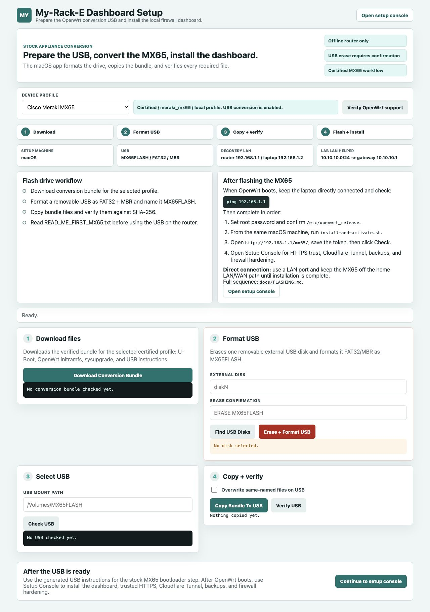
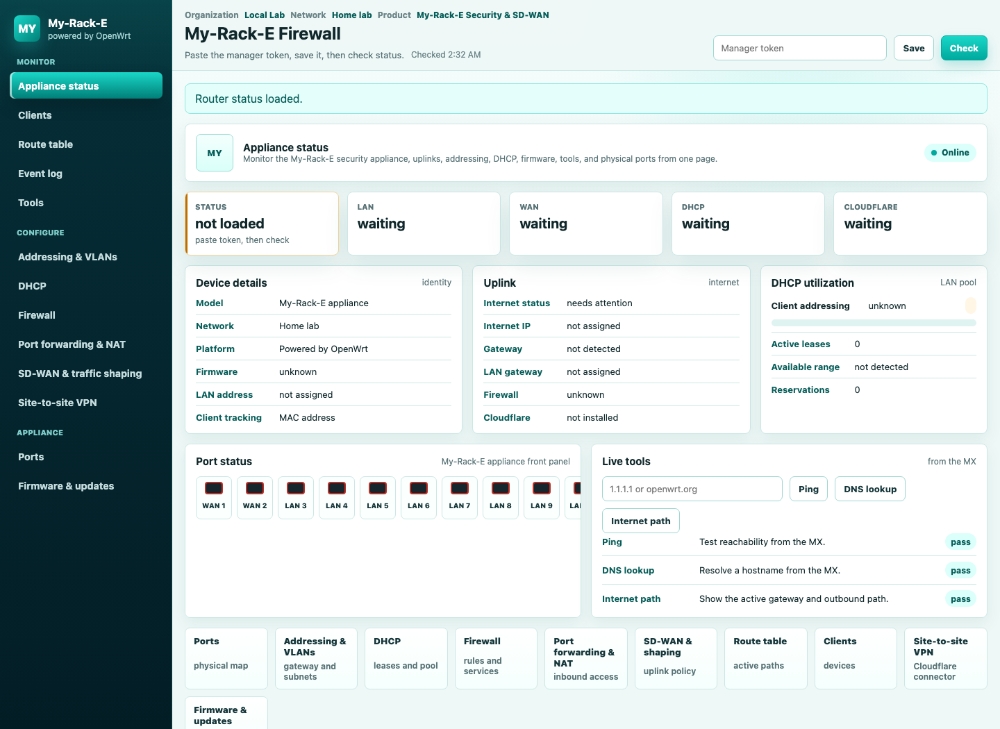
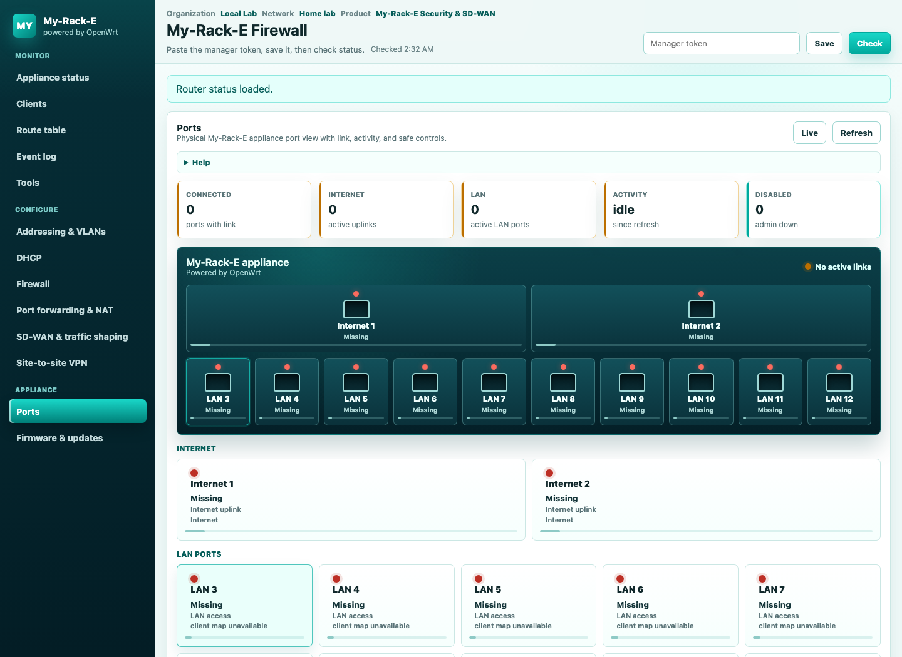

# My-Rack-E Dashboard - OpenWrt Firewall Manager

My-Rack-E Dashboard turns compatible Cisco Meraki MX appliances that no longer use the manufacturer-supported dashboard path into local OpenWrt firewall appliances with a browser-based management interface.

The certified target is the MX65. The repository includes a macOS setup app for the stock-conversion USB, a router-hosted dashboard, trusted local update packaging, Cloudflare Tunnel helpers, firewall hardening scripts, and a local MCP management bridge.

The setup and USB-formatting workflow runs from macOS. The installed dashboard runs locally on the OpenWrt appliance.

My-Rack-E is not affiliated with, endorsed by, or sponsored by Cisco Meraki. It does not include Cisco/Meraki logos, firmware, dashboard assets, or proprietary cloud functionality.



## Included

- macOS USB setup wizard for a stock MX65 conversion drive.
- Optional macOS `.command` launchers in `tools/macos/`.
- Router-hosted My-Rack-E dashboard under `/mx65/`, served locally from the OpenWrt appliance.
- Firewall-management sections for appliance status, clients, addressing, VLANs, DHCP, firewall, NAT, SD-WAN/tunnel status, ports, and updates.
- Real OpenWrt-backed actions through UCI, firewall validation, service control, backups, and rollback guards.
- Device-profile registry for OpenWrt-compatible MX models.
- Trusted update pathway: package manifest, archive SHA-256 verification, staged install, managed-file verification, and rollback backup.
- Local MCP stdio server for agent-assisted read-only checks and guarded management actions.

## Certification Status

| Device | OpenWrt profile | Dashboard | Stock USB conversion |
| --- | --- | --- | --- |
| Cisco Meraki MX65 | `meraki_mx65` | Certified | Certified |
| Cisco Meraki MX64 | `meraki_mx64` | Recognized | Blocked until conversion metadata is verified |
| Cisco Meraki MX64 A0 | `meraki_mx64-a0` | Recognized | Blocked until conversion metadata is verified |

Recognized MX64 profiles are present because official OpenWrt release metadata publishes sysupgrade images for them. Destructive setup automation remains disabled until bootloader, port, and recovery details are tested for those models.

## Screenshots





## Quick Start

1. Clone or unpack the repo on macOS.
2. Start the local setup app:

   ```sh
   python3 app.py
   ```

3. Open the printed local URL.
4. Select the certified `Cisco Meraki MX65` profile.
5. Download the conversion bundle.
6. Format the USB as `MX65FLASH` from the app, then copy and verify the bundle.
7. Follow `READ_ME_FIRST_MX65.txt` on the USB for the offline stock-device conversion.
8. After OpenWrt boots, install and activate the dashboard:

   ```sh
   ./scripts/install-and-activate.sh
   ```

9. Open the printed `/mx65/` dashboard URL and save the manager token.

Full setup instructions are in [docs/SETUP.md](docs/SETUP.md).

## Defaults

| Item | Default |
| --- | --- |
| Setup machine | macOS |
| Local setup app | `http://127.0.0.1:8787` |
| Certified profile | `Cisco Meraki MX65` / `meraki_mx65` |
| USB label / format | `MX65FLASH`, FAT32, MBR |
| Stock recovery router IP | `192.168.1.1` |
| Direct laptop IP | `192.168.1.2/24` |
| Router-hosted dashboard | `http://192.168.1.1/mx65/` |
| Optional lab LAN | `10.69.69.0/24` -> gateway `10.69.69.1` |
| DHCP helper policy | gateway is first usable IP; low addresses stay reserved for infrastructure; client pool starts later in the subnet |

### Fast ops

- Recover the manager token if the browser loses it:

  ```sh
  ./scripts/show-manager-token.sh
  ```

- Print current manager status:

  ```sh
  ./scripts/check-status.sh
  ```

- View managed manager files and security audit:

  ```sh
  ./scripts/mx65ctl.py status
  ./scripts/mx65ctl.py security-audit
  ```

## Validation

For a local health check after changing scripts, docs, or UI code:

```sh
./scripts/repo-readiness-check.sh
```

The check verifies the setup app, router dashboard scripts, shell workflows, MCP bridge, required docs, preview images, and common secret/artifact mistakes.

## Documentation

- [Setup guide](docs/SETUP.md)
- [Flashing notes](docs/FLASHING.md)
- [System architecture](docs/SYSTEM.md)
- [Firewall how-to](docs/FIREWALL-HOWTO.md)
- [Device profiles](docs/DEVICE_PROFILES.md)
- [MCP management server](docs/MCP.md)
- [Naming and trademark notes](docs/TRADEMARKS.md)
- [Wi-Fi support reality](docs/WIFI.md)
- [Security policy](SECURITY.md)

## Safety Rules

- This project does not bundle firmware binaries, bootloader binaries, private keys, tokens, backups, or router configuration exports.
- The setup app prepares and verifies USB files. It does not silently flash the router.
- USB formatting is guarded by macOS external-disk detection and the exact phrase `ERASE MX65FLASH`.
- Unsupported device profiles cannot run stock-conversion automation.
- MX64W/MX65W internal Wi-Fi is treated as unsupported. Use a separate access point.

## License

GPL-2.0-only. See [LICENSE](LICENSE).
